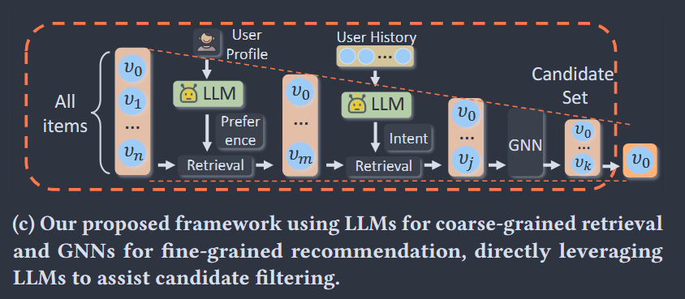
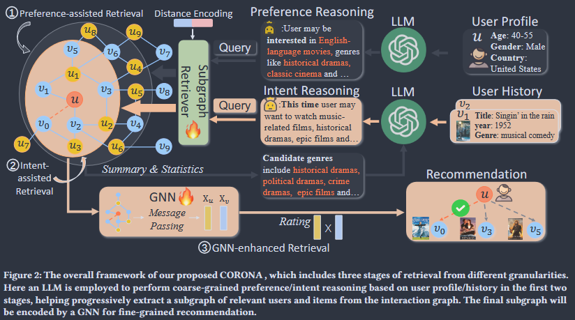

# Literature Review

Goal:
Identify promising retrieval techniques from recent papers, understand how hierarchical structures enhance retrieval  

Jakob emphasized: embeddings + GNN refinement layers trained on small datasets

# Promising Models/Techniques

All interesting models, papers, remarks, facts and high level explanations.

[KNN]
**RETRO** - employs KNN to extract approximate relevant neighbors from the constructed key-value database by calculating the L2 distance.
Paper: Improving language models by retrieving from trillions of tokens

[CONTEXT GENERATION]
**GAR** - to capture multifaceted aspects of the query, introduces diverse context generation, enriching the initial query with additional contexts before applying BM25 retrieval.
Paper: Generation-augmented retrieval for open-domain question answering

[RERANK FOCUS]
**EAR** - implements a re-ranking process that selects the optimal candidate from multiple expanded queries to improve retrieval accuracy.
Paper: Expand, rerank, and retrieve: Query reranking for open-domain question answering

[Hybrid, BM25]
Approach to identify approximate neighbors using sentence transformers for representation and then apply BM25 for re-ranking, effectively balancing accuracy with computational efficiency on large-scale retrieval tasks.
Paper: Surface-based retrieval reduces perplexity of retrieval-augmented language models

[GNNs]
**GNN-RET** - Paper: Graph neural network enhanced retrieval for question answering of LLMs

**G-Retriever** - Paper: G-retriever: Retrieval-augmented generation for textual graph understanding and question answering

Interesting query/graph processing step in the survey paper "A Survey of Graph Retrieval-Augmented Generation for Customized Large Language Models":

> For query preprocessing, the system transforms the input question into a structured representation through vectorization or key term extraction. These representations serve as search indices for subsequent retrieval operations. On the graph side, the graph database undergoes more comprehensive processing where pretrained language models transform graph elements (entities, relations, and triples) into dense vector representations that serve as retrieval anchors. Additionally, some advanced retrieval models apply graph neural networks (GNNs) on the graph database to extract high-level structural features, while a few methods even adopt rule mining algorithms to generate rule banks as rich, searchable indexes of the graph knowledge.

[Rule Mining, Logical Rule-based]
**RuleRAG** - utilizing rule mining.
Paper: RuleRAG: Rule-guided retrieval-augmented generation with language models for question answering

[LLMs, GNNs]
**CORONA** - Chain of Retrieval ON grAphs. 1) LLM preference reasoning based on user profiles -> _preference-assisted retrieval_, interaction subgraph -> _intent-assisted retrieval_, GNN to capture high-order collaborative filtering information from extracted subgraph -> _GNN-enhanced retrieval_.
Paper: CORONA: A Coarse-to-Fine Framework for Graph-based Recommendation with Large Language Models

From CORONA paper, focused on retrieval/candidate filtering:

2 approaches for LLM integration:

- Applying LLMs _after_ candidate filtering: integrate relevant (e.g. item candidates) info into natural language-based prompts, derive recommendations from LLM generated responses.
- Applying LLMs _before_ candidate filtering: LLMs enrich user/item attributes along interactions for pre-processing, augmented dataset fed into traditional RecSys for candidate filtering.

Retrieval stage:

1. User profile as input to an LLM for preference reasoning, generating a query embedding to perform preference-assisted retrieval, which extracts a subgraph aligned with the user's general preferences from the interaction graph.
2. Combine the user's purchase history with statistical information from the previous subgraph, prompting the LLM for intent reasoning; resulting query embedding supports intent-assisted retrieval, refining the subgraph to reflect more personalized and short-term user intent.
3. GNN-enhanced retrieval, where the GNN processes the subgraph to capture valuable relationships, producing the final recommendation results.

- Subgraph retriever: retrieve the most relevant items based on the query, designed as a simple subgraph retriever similar to the attention mechanism.

[LLMs, Infer Structure]
**FastRAG** - use LLM to extract information via schema learning and script learning -> use LLMs to infer structure; in our case potentially the label hierarchy.
Paper: FastRAG: Retrieval Augmented Generation for Semi-structured Data

---

### Structure-Aware Embeddings

[Structural Context, Embeddings]
**Struc-EMB** - inject structural context (linked issues, cited papers) directly at encoding time rather than post-hoc.
Two strategies:

- _Sequential concatenation_: append neighbor texts to input before encoding. Better for noisy, moderate-length contexts.
- _Parallel caching_: encode neighbors separately, fuse representations. Scales better to long, high-signal contexts.

Outperforms text-only and post-hoc graph aggregation baselines across retrieval, clustering, and recommendation tasks.
Code: `github.com/Graph-COM/Struc-Emb`
Paper: Struc-EMB: The Potential of Structure-Aware Encoding in Language Embeddings (arXiv:2510.08774)

[Graph, Heterogeneous Data, Metadata]
**SAGE** - Structure Aware Graph Expansion. Offline: construct chunk-level graph using metadata-driven similarity (shared labels, topic overlap, entity co-occurrence) with percentile-based pruning, no costly KG extraction. Online: baseline retriever selects seed nodes -> expand first-hop neighbors -> filter with dense+sparse scoring.
Relevant because edge construction can directly use our label hierarchy and ticket metadata.
+5.7–8.5 recall points over flat retrieval on heterogeneous corpora.
Paper: SAGE: Structure Aware Graph Expansion for Retrieval of Heterogeneous Data (arXiv:2602.16964)

---

### GNN Refinement

[GNNs, Re-ranking]
**GNN-Ret / RGNN-Ret** - build a similarity graph over retrieval candidates, use GNN to propagate relevance signals across it and refine scores. Recurrent variant integrates evidence across multi-hop steps. GNN refines a frozen retriever's output -> small training data requirement.
+10.4% accuracy over strong baselines on multi-hop QA.
Paper: GNN Enhanced Retrieval for Question Answering of LLMs (arXiv:2406.06572)

Proposed novel method pipeline:

1. Multi-field encode: `e_text = LLM(description)` + `e_hier = HierEmbed(label_path)` -> fuse via MLP
2. Coarse retrieval: FAISS ANN on fused embedding -> top-K candidates + subgraph
3. GNN refinement: 2-layer GNN over candidate subgraph (hierarchical edges + explicit links) -> re-ranked results

---

### Hierarchical Structure in Retrieval

[Hierarchy, Dual Encoder, Training Recipe]
**Hierarchical Retrieval / pretrain-finetune recipe** - standard dual encoders degrade for documents far from the query in the label hierarchy (_lost-in-the-long-distance_ phenomenon). Fix: pretrain embeddings to respect label hierarchy structure first, then fine-tune on retrieval task.
Long-distance recall: 19% -> 76% on hierarchical document retrieval.
Directly applicable: pretrain on GitHub error type taxonomy or paper research area ontology before fine-tuning on issue-link / citation retrieval.
Paper: Hierarchical Retrieval: The Geometry and a Pretrain-Finetune Recipe (arXiv:2509.16411)

[Hyperbolic Geometry, Embeddings]
**HypRAG / HyperbolicRAG** - replace Euclidean embedding space with hyperbolic space (Lorentz/Poincaré model), which grows exponentially with radius and naturally preserves tree-like hierarchies. Siblings cluster; parent-child distance reflects specificity. 20%+ radial separation between general and specific concepts, absent in Euclidean embeddings.
HyperbolicRAG uses dual-space: Euclidean semantic similarity + hyperbolic structural awareness.
Remark: requires Riemannian optimizers and careful numerical handling, too much scope, maybe Phase 5, but rather not.
Papers: HypRAG (arXiv:2602.07739), HyperbolicRAG (arXiv:2511.18808)

[Hierarchy, Coarse-to-Fine, Index]
**Hierarchical Semantic Retrieval (Cobweb)** - use label hierarchy directly as a tree-structured retrieval index. Internal nodes as coarse prototypes -> retrieve at branch level first, drill to leaves. Simple, explainable, no new training required.
Paper: Hierarchical Semantic Retrieval with Cobweb (arXiv:2510.02539)

# Possible Applications on our Use Case / Domain

### Tier 1 - Text Retrieval (Baseline)

BM25, sparse keyword baseline. Good for exact error name matches in tickets. Blind to hierarchy and paraphrase.
Sentence Transformers / DPR, dense semantic baseline. Treats all fields as flat concatenated string, exactly the limitation richer tiers should beat. Can check for title-only vs. concat-all-fields to understand noise from unstructured descriptions as an extra.

### Tier 2 - Metadata-Aware Retrieval

Multi-field embeddings, separate embedding(?) per field (description, label path). Tests whether structured fields carry signal beyond text alone.
Hierarchical pretraining (from Hierarchical Retrieval paper), lost-in-the-long-distance is directly relevant here. Pretrain embeddings to respect label hierarchy distance, then fine-tune on issue-link / citation pairs. Cobweb, use label hierarchy as tree-structured index, no training required. Coarse branch first (e.g. all Backend issues), drill to leaves (depends on how sophisticated/deep the hierachies are). Shows well what pure hierarchy can achieve as the next level.

### Tier 3 - Graph Expansion

SAGE, most directly applicable. Offline graph construction via metadata-driven similarity maps cleanly onto our data:

GitHub: shared labels, same-PR resolution, explicit issue links
Papers: citation edges, shared-author edges, same-venue/research group/chair etc. weak links

Citation / issue-link expansion, take top-K dense results, add direct neighbors as additional candidates, re-score by original embedding.
Struc-EMB, inject neighbor texts directly at encoding time (sequential concatenation variant). Append linked issue titles / cited paper titles before encoding.

### Tier 4 - GNN Refinement

GNN-Ret / RGNN-Ret, build subgraph over top-K candidates, run 2-layer GNN to propagate relevance and re-rank. Designed for small training sets, fits moreo or less our scope.
Proposed novel pipeline:

Multi-field encode: e_text = Encoder(description) + e_hier = HierEmbed(label_path) -> fuse via MLP
Coarse retrieval: FAISS ANN on fused embedding → top-K candidates + subgraph
GNN refinement: 2-layer GNN over candidate subgraph (hierarchical edges + explicit links) -> re-ranked results

## Remark

Having the GNN keyword led to us focusing too much on GNNs mainly, but GNNs were only suggested, we need a neutral approach to this topic even though it makes sense to think about Graphs here because of hierchacical structures in the mixed-property data sets. So we did some research without GNN as a keyword to identify promising techniques in general.

## Bibliography

Abane, A., Bekri, A., Battou, A., & Bensalem, S. (2025). FastRAG: Retrieval Augmented Generation for Semi-structured Data. 2025 IEEE/ACS 22nd International Conference on Computer Systems and Applications (AICCSA), 1–8. https://doi.org/10.1109/AICCSA66935.2025.11315184
Cao, L., Wang, R., Li, J., Zhou, Z., & Yang, M. (2025). HyperbolicRAG: Enhancing Retrieval-Augmented Generation with Hyperbolic Representations (arXiv:2511.18808). arXiv. https://doi.org/10.48550/arXiv.2511.18808
Chen, J., Yang, X., Yang, C., Bao, J., Guo, Z., Li, Y., & Shi, C. (2025). CORONA: A Coarse-to-Fine Framework for Graph-based Recommendation with Large Language Models. Proceedings of the 48th International ACM SIGIR Conference on Research and Development in Information Retrieval, SIGIR ’25, 2048–2058. https://doi.org/10.1145/3726302.3729937
Freymuth, N., Liu, D., Ricatte, T., & Mansour, S. (2025). Hierarchical Multi-field Representations for Two-Stage E-commerce Retrieval (arXiv:2501.18707). arXiv. https://doi.org/10.48550/arXiv.2501.18707
Gupta, A., Singaravadivelan, K., & Wang, Z. (2026). Hierarchical Semantic Retrieval with Cobweb (arXiv:2510.02539). arXiv. https://doi.org/10.48550/arXiv.2510.02539
Huang, J., Chen, J., Lin, J., Qin, J., Feng, Z., Zhang, W., & Yu, Y. (2025). A Comprehensive Survey on Retrieval Methods in Recommender Systems. ACM Trans. Inf. Syst., 44(1), 28:1-28:43. https://doi.org/10.1145/3771925
Li, Z., Guo, Q., Shao, J., Song, L., Bian, J., Zhang, J., & Wang, R. (2024). Graph Neural Network Enhanced Retrieval for Question Answering of LLMs (arXiv:2406.06572). arXiv. https://doi.org/10.48550/arXiv.2406.06572
Liu, S., Wang, H., Li, M., & Li, P. (2025). Struc-EMB: The Potential of Structure-Aware Encoding in Language Embeddings (arXiv:2510.08774). arXiv. https://doi.org/10.48550/arXiv.2510.08774
Luo, L., Zhao, Z., Haffari, R., Phung, D., Gong, C., & Pan, S. (2026). GFM-RAG: Graph Foundation Model for Retrieval Augmented Generation. Advances in Neural Information Processing Systems, 38, 36371–36405. https://proceedings.neurips.cc/paper_files/paper/2025/hash/33ca0b1102b54c191a9a45a05adafaf4-Abstract-Conference.html
Madhu, H., Bui, N., Maatouk, A., Tassiulas, L., Krishnaswamy, S., Yang, M., Ganguly, S., Srinivasan, K., & Ying, R. (2026). HypRAG: Hyperbolic Dense Retrieval for Retrieval Augmented Generation (arXiv:2602.07739). arXiv. https://doi.org/10.48550/arXiv.2602.07739
Mavromatis, C., & Karypis, G. (2025). GNN-RAG: Graph Neural Retrieval for Efficient Large Language Model Reasoning on Knowledge Graphs. In W. Che, J. Nabende, E. Shutova, & M. T. Pilehvar (Eds.), Findings of the Association for Computational Linguistics: ACL 2025 (pp. 16682–16699). Association for Computational Linguistics. https://doi.org/10.18653/v1/2025.findings-acl.856
Muni, D. P., Roy, S., Chiang, Y. T. Y. J. J. L., Viallet, A. J.-M., & Budhiraja, N. (2017). Recommending resolutions of ITIL services tickets using Deep Neural Network. Proceedings of the 4th ACM IKDD Conferences on Data Sciences, CODS ’17, 1–10. https://doi.org/10.1145/3041823.3041831
Peng, B., Zhu, Y., Liu, Y., Bo, X., Shi, H., Hong, C., Zhang, Y., & Tang, S. (2024). Graph Retrieval-Augmented Generation: A Survey (arXiv:2408.08921). arXiv. https://doi.org/10.48550/arXiv.2408.08921
Pereira, L. S. B., Pizzio, R., & Bonho, S. (2025, July 29). Comparison of Information Retrieval Techniques Applied to IT Support Tickets. arXiv.Org. https://arxiv.org/abs/2508.05654v1
PolyU X AI Lab. (2026). DEEP-PolyU/Awesome-GraphRAG [Computer software]. https://github.com/DEEP-PolyU/Awesome-GraphRAG (Original work published 2024)
Titiya, P., Khoja, R., Wolfson, T., Gupta, V., & Roth, D. (2026). SAGE: Structure Aware Graph Expansion for Retrieval of Heterogeneous Data (arXiv:2602.16964). arXiv. https://doi.org/10.48550/arXiv.2602.16964
Xu, Z., Cruz, M. J., Guevara, M., Wang, T., Deshpande, M., Wang, X., & Li, Z. (2024). Retrieval-Augmented Generation with Knowledge Graphs for Customer Service Question Answering. Proceedings of the 47th International ACM SIGIR Conference on Research and Development in Information Retrieval, SIGIR ’24, 2905–2909. https://doi.org/10.1145/3626772.3661370
You, C., Jayaram, R., Suresh, A. T., Nittka, R., Yu, F., & Kumar, S. (2026). Hierarchical Retrieval: The Geometry and a Pretrain-Finetune Recipe. Advances in Neural Information Processing Systems, 38, 149239–149261. https://proceedings.neurips.cc/paper_files/paper/2025/hash/db5e34020dab7c046908bddace8e5cd9-Abstract-Conference.html
Zangari, A., Marcuzzo, M., Schiavinato, M., Gasparetto, A., & Albarelli, A. (2023). Ticket automation: An insight into current research with applications to multi-level classification scenarios. Expert Systems with Applications, 225, 119984. https://doi.org/10.1016/j.eswa.2023.119984
Zhang, Q., Chen, S., Bei, Y., Yuan, Z., Zhou, H., Hong, Z., Chen, H., Xiao, Y., Zhou, C., Dong, J., Chang, Y., & Huang, X. (2025). A Survey of Graph Retrieval-Augmented Generation for Customized Large Language Models (arXiv:2501.13958). arXiv. https://doi.org/10.48550/arXiv.2501.13958
Zhu, Z., Huang, T., Wang, K., Ye, J., Chen, X., & Luo, S. (2026). Graph-Based Approaches and Functionalities in Retrieval-Augmented Generation: A Comprehensive Survey. ACM Comput. Surv., 58(10), 261:1-261:38. https://doi.org/10.1145/3795880
